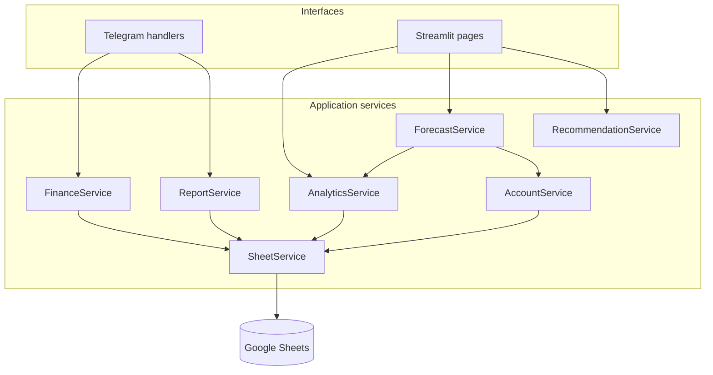
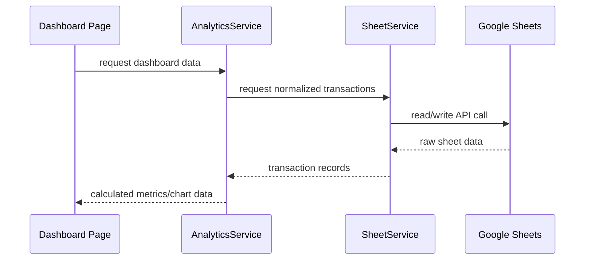
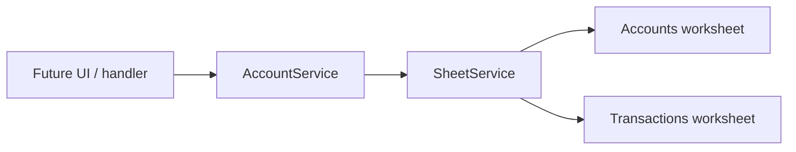

# Architecture

## Layered architecture

## Responsibilities

| Layer | Responsibility | Must not do |
| --- | --- | --- |
| Telegram handlers | Receive Telegram events, manage FSM, render messages/keyboards | Perform calculations or call Google Sheets directly |
| Streamlit pages | Compose page UI and present service results | Query Google Sheets or implement business rules |
| `FinanceService` | Validate and format transactions | Render UI or persist data directly |
| `AccountService` | Account lifecycle, activity checks, and calculated balances | Render UI, mutate transaction ownership, or access Google Sheets directly |
| `AnalyticsService` | Aggregate data for dashboard metrics and charts | Render Streamlit widgets |
| `ForecastService` | Build category expense and Goal V2 forecast output | Forecast income, render widgets, or access Google Sheets directly |
| `RecommendationService` | Allocate deterministic recommendation capacity from supplied Forecast V2 results | Read or mutate Google Sheets, create financial records, or generate generic AI advice |
| `ReportService` | Produce report-oriented business output | Handle Telegram callbacks |
| `SheetService` | Read and write Google Sheets | Apply dashboard or financial business rules |
| Dashboard components | Reusable visual elements | Load data or calculate business metrics |

## Required dashboard data path

Dashboard pages must never access Google Sheets or `SheetService` directly.

## Account foundation

`AccountService` owns Account lifecycle rules and the derived balance engine.
`SheetService` owns the `Accounts` worksheet and its schema only.

Current balance is never persisted as an editable field. For this sprint it is
calculated as `initial balance + linked income - linked expense`. Transactions
whose `account_id` is null are historical data and do not affect an Account.

Account Movements are a separate persistence stream and never enter income or
expense analytics. Current balance now derives as: `initial balance + linked
income - linked expense + transfer in - transfer out + adjustment`.

## Goal V2

Goal V2 is persisted separately in the `Goals` worksheet and links to an
immutable Account ID. Goals never store a current or allocated balance: their
progress is derived from `AccountService` current balance. `GoalService` owns
goal lifecycle, pace, required contribution, and calculated health.

## Forecast V2

`ForecastService` owns deterministic forecast calculations. Expense Forecast
learns only from cleaned Normal Expense behavioral history through
`AnalyticsService`. Periodic cash payments remain actual expenses but never
become single-day behavioral observations; One-off expenses are excluded from
behavioral training entirely.
Strong Forecast eligibility requires at least 14 calendar days of coverage,
10 Expense transactions, and 7 active days. Categories with at least 3 days,
3 transactions, and 2 active days may still provide a clearly marked
low-confidence basic forecast; records below that threshold remain in an
explicit insufficient-data state. Dashboard users choose which forecastable
categories to inspect; this presentation selection never changes Financial
Outlook, Spending Risk, Balance Risk, Recommendation, or Scenario baseline.

Financial Outlook derives system-wide Current Balance from active Accounts and
subtracts the future projections of every forecastable category: all sufficient
categories plus limited categories with a valid basic forecast. Insufficient
categories are retained as diagnostics but excluded from the global projection.
Goal Forecast reads the Goal V2/Account-derived contribution pace from
`GoalService`; it never reads legacy allocated amounts or forecasts Income.

Financial Outlook also owns the forward-only Estimated Balance Trajectory. It
starts at the Account-derived current balance on the Forecast reference date,
then distributes each globally included category's `projected_remaining_expense` across
the remaining calendar days. Every point exposes the date, estimated balance,
projected spending for that day, and cumulative global spending. Its final
balance must equal `current balance − global projected remaining spending`.
Future income and categories with insufficient Forecast data are excluded by
design; negative trajectory values remain visible.

The Profile-owned Monthly Spending Limit is a local JSON planning preference,
not a Google Sheets record or financial event. `ForecastService` calculates
its status in memory from `normalized current-month spending + global projected
remaining spending`. It never treats this as a complete month-end expense
forecast: categories with insufficient Forecast data remain excluded. A positive
configured limit emits Spending Risk only when tracked
spending exceeds it; an unset or zero limit disables that warning safely.

## Classified Expense metadata

The append-only Transaction schema is:

`Tanggal | Jenis | Kategori | Nominal | Catatan | Transaction ID | Account ID | Expense Type | Coverage Months`

`Transaction ID` and `Account ID` remain immutable/nullable under their
existing V2 rules. Expense classification is analytical metadata only:

| Transaction type | Expense Type | Coverage Months | Normalized monthly contribution |
| --- | --- | --- | --- |
| Income | `null` | `null` | `0` |
| Expense | Normal | `null` | full actual amount |
| Expense | Periodic | integer `>= 1` | actual amount ÷ coverage months, rounded to Rupiah |
| Expense | One-off | `null` | `0` |

`FinanceService` validates and normalizes this metadata through the centralized
transaction-schema contract. Missing Expense metadata on legacy rows is read
as `Normal`; new Telegram and Dashboard-create Expenses therefore default to
`Normal` without changing their input flow. Dashboard edit is the only
classification surface.

This produces two deliberately separate views: actual cash records still power
current/account balances, actual Expense, Overview, Analytics, transaction
count, Goals, and Financial Outlook's current balance. Normalized contributions power only the
Monthly Spending Limit, Spending Risk, and comparable Saving Candidate
baselines. Globally included future Forecast categories remain category projections and
are treated as Normal for risk purposes because no future transaction metadata
exists. No synthetic transaction, future allocation, or additional Google
Sheets read is created.

## Scenario Simulator V1

`ScenarioService` is a pure service that receives an already-loaded Financial
Outlook and Goal Forecast. It does not create a `SheetService`, read Google
Sheets, or mutate Transactions, Accounts, Account Movements, or Goals. The
Forecast page owns temporary `scenario_*` Streamlit session state; it collects
user inputs and delegates all validation and calculations to the service.

The baseline is the global Financial Outlook's `projected_remaining_expense`
sum. Category reductions produce a hypothetical future-spending total and
Potential Saving. The baseline and Scenario trajectories use Forecast V2's same
deterministic remaining-days distribution, both start at Current Balance, and
end at their matching estimated balance. Goal allocations are hypothetical
monthly contributions only: they may improve a derived Goal health/completion
projection, but never create a transfer, movement, transaction, or balance
change.

The Scenario presentation follows its calculation dependency order: Spending
Adjustments, impact summary, Goal Allocation, trajectory, then Goal Impact.
Its primary impact summary exposes only Balance Improvement, Scenario Estimated
Balance, and Unallocated Saving; audit values remain in a secondary calculation
expander. Goal Allocation uses Total Potential Saving as its capacity but never
reduces the Scenario Estimated Balance.

## Overview and Analytics integration

Overview separates present financial position from filtered historical activity.
`AccountService.get_current_balance_summary()` supplies the active-Account
Current Balance independently of the global date range. `AnalyticsService`
supplies only actual Income/Expense Transactions for period Income, Expense,
Net Cashflow, charts, and Recent Transactions. Account Movements are stored
separately and are defensively excluded from Analytics even if malformed data
appears in a transaction dataframe. Historical Transactions without an Account
ID remain included in historical analytics.

Analytics stays transaction-driven: its category, trend, period-comparison,
and statistics methods accept only normalized `income` and `expense` rows.
It exposes the standardized V1 category vocabulary alongside stored legacy
categories without reclassifying historical data.

## Recommendation Engine V1

`RecommendationService` is a pure, non-persistent rule layer. Saving Candidate
preferences are stored in the local settings JSON and default to `false`.
Candidate analysis does not read Forecast UI selection and does not require
strong Forecast eligibility. Instead, a category needs 7 calendar days of
prior-month history, 5 Expense transactions, and 4 active days before its
optimization history is sufficient. Its current spending through today is
compared with a historical normal over the same number of calendar days:
`historical total ÷ historical coverage days × day of month`. Optimization
excess is `current comparable-period spending − historical normal`; only a
positive excess may become saving capacity.

When no previous-period data exists but the current period itself meets the
strong 14-day, 10-transaction, 7-active-day threshold, ForecastService creates
a **Limited Optimization Baseline**. It splits the current observed coverage
into chronological halves, normalizes earlier-half spending to the later-half
calendar-day count, and compares it with later-half spending. The result is
explicitly labelled as limited confidence.

Saving Candidate configuration is available for every standardized V1 Expense
Category, plus any discovered legacy Expense Category. It is a persisted user
preference, not a data-quality flag: an enabled category with insufficient
history is retained in Recommendation output with an explicit diagnostic.

Recommendation consumes the already calculated global Financial Outlook rather
than building a second monthly Income-versus-Expense projection. Its only
future balance trigger is `global_estimated_balance < 0`; the shortfall is the
absolute value of that negative balance. Forecast detail selection cannot affect
Balance Risk.

Recommendation also receives the in-memory Monthly Spending Limit status.
Its priority is Balance Risk (critical), Spending Risk (warning), Goal Risk,
then independent Spending Optimization opportunity. Reductions remain bounded
by positive Saving Candidate capacity; Goal recommendations begin only after
the active balance and spending-limit gaps are addressed.

Saving Candidate analysis stays independent of Forecast detail selection. Positive,
history-backed optimization excess becomes a bounded spending opportunity even
when the category is not selected for Forecast. Balance Risk takes priority,
then spending optimization, then active Goals whose health is `At Risk` or
`Off Track`. Expected balance impact is calculated as baseline estimated
balance plus suggested reductions. Scenario handoff remains temporary and
contains only globally forecastable category adjustments so it can be applied safely.

### Forecast and recommendation performance note

The Forecast page reuses one loaded expense-forecast result, the derived
Financial Outlook, and Goal Forecast for display and Recommendation analysis.
`RecommendationService` is pure in-memory logic and does not independently
read Transactions, Accounts, Account Movements, or Goals.

## Transaction-to-Account integration

New transactions are validated by `FinanceService` against an active Account
through `AccountService`. The relationship persists the immutable `account_id`,
never the account name. Existing records with a null Account ID remain readable
and analytically valid, but do not change Account balances.

## Profile, Settings, and data-management ownership

`Profile` is the only user-facing home for Personal information, Financial
Preferences, Accounts, and Goals. The Monthly Spending Limit is a local
planning threshold only; it never changes a Transaction, Account, Movement,
Goal, Income KPI, or financial source of truth. The Account, Account Movement,
and Goal domain services remain their respective sources of truth.

`Settings` is limited to safe integration status checks and Transaction data
management. It shows Telegram and Google Sheets state without revealing tokens
or credentials. `SettingsService` persists Personal profile data and
Forecast/Recommendation-owned Saving Candidate preferences. Legacy JSON keys
such as `current_balance`, `monthly_income`, `monthly_saving_target`, `payday`,
and `risk_preference` remain readable only for compatibility and must not
influence V2 calculations.

`DataManagementService` offers a deliberately scoped **Transaction-only**
backup, restore, and reset. It preserves every V2 Transaction field, including
`transaction_id`, nullable `account_id`, `expense_type`, and
`coverage_months`, after schema validation. It does
not snapshot, restore, or reset Accounts, Account Movements, or Goals. The UI
states that limitation before destructive operations; a complete V2 financial
backup is deferred until a relational multi-worksheet restore is safe.

Goal V2 is the only active Goal implementation. It derives Goal progress from
the linked Account through `GoalService`; retired V1 allocation-based Goal
artifacts must not be restored or used as an alternative financial source of
truth.

## Google Sheets read-cache and resilience

`SheetService` owns one process-local, centralized read cache for the four
primary datasets: Transactions, Accounts, Account Movements, and Goals. Each
dataset has a 45-second TTL and returns defensive copies, so callers may safely
filter or normalize their data in memory without changing the shared snapshot.
The workbook connection is initialized once per running process; constructing a
domain service remains cheap and does not independently open the spreadsheet.

Successful mutations invalidate only their own raw dataset: Transaction CRUD
invalidates Transactions, Account lifecycle actions invalidate Accounts,
Movement actions invalidate Account Movements, and Goal lifecycle actions
invalidate Goals. Dependent services calculate from the next fresh snapshot;
no financial source of truth is stored in `st.session_state`.

Read operations retry quota and temporary transport failures up to three times
with bounded increasing delays. If a fresh read still fails but a prior snapshot
exists, the application uses that snapshot, preserves its original load time,
and renders a stale-data warning. Writes are never retried or represented as
successful unless Google Sheets confirms persistence.
