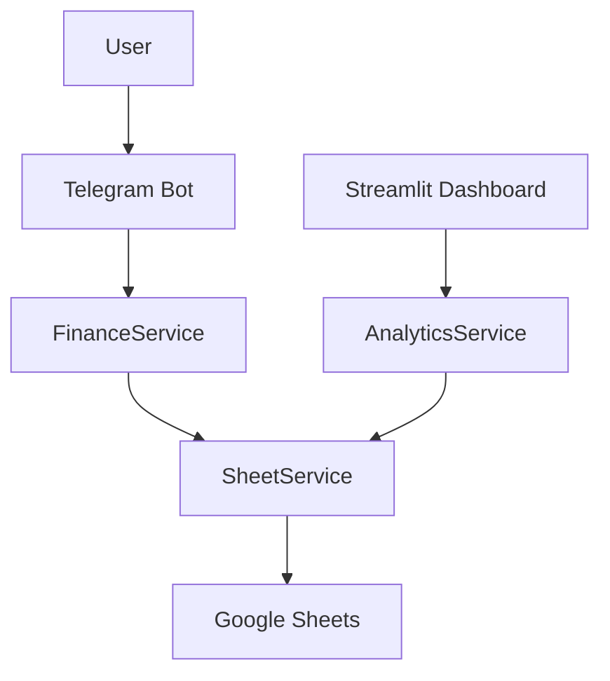

# Personal Finance System — AI Development Context

## Purpose

Personal Finance System helps users record income and expenses through a Telegram bot, then review their financial data through a Streamlit dashboard.

## Product status

- **Phase 1 — Telegram Bot:** completed.
- **Phase 2 — Dashboard:** foundation and live Google Sheets integration completed; expense-by-category visualization is in progress.
- **Current storage:** Google Sheets.

## Technology

| Area | Technology |
| --- | --- |
| Language | Python |
| Bot | Aiogram |
| Dashboard | Streamlit |
| Data processing | Pandas |
| Visualizations | Plotly |
| Spreadsheet access | gspread and Google Sheets API |

## Core application flow

## Guidance for AI assistants

1. Inspect existing services and reusable dashboard components before adding code.
2. Preserve the Telegram bot workflow unless a feature explicitly changes it.
3. Keep dashboard pages thin: they orchestrate UI and request data from services.
4. Do not introduce direct Google Sheets access into dashboard pages.
5. Update the decision log, changelog, and relevant specification when behavior or architecture changes.
