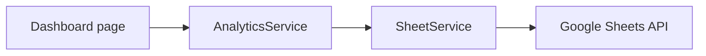

# Internal API Reference

This project currently exposes internal Python service APIs rather than a public HTTP API.

## FinanceService

| Method | Purpose |
| --- | --- |
| `validate_amount(text)` | Validate and convert a user-entered monetary value to a positive integer. |
| `format_rupiah(amount)` | Format an integer amount as Indonesian Rupiah. |
| `build_summary(data)` | Produce a confirmation summary for a transaction. |
| `build_transaction(data, transaction_date=None)` | Build normalized transaction data, including an ISO date. |
| `daily_summary(transactions, target_date=None)` | Aggregate daily income, expense, balance, and count. |
| `monthly_summary(transactions, target_date=None)` | Aggregate monthly totals and leading expense categories. |

## SheetService

| Method | Purpose |
| --- | --- |
| `connect()` | Create the Google Sheets worksheet connection. |
| `append(transaction)` | Append one normalized transaction to the Transactions worksheet. |
| `get_all()` | Read and normalize transaction records from Google Sheets. |

## ReportService

| Method | Purpose |
| --- | --- |
| `get_today_report()` | Build Telegram-ready report text for today. |
| `get_month_report()` | Build Telegram-ready report text for the current month. |

## AnalyticsService

`AnalyticsService` is the designated API for dashboard business logic. Its implementation should provide dashboard summaries, filtered transaction data, and chart-ready aggregations as Phase 2 expands.

## Integration rules

Do not bypass this path by importing `SheetService` in a dashboard page.
