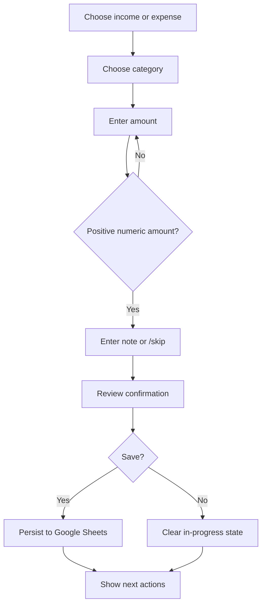

# Feature Specification

## Transaction recording

### Input flow

### Transaction data contract

| Field | Type | Description |
| --- | --- | --- |
| `date` | ISO date string | Transaction date, generated by the finance service. |
| `type` | `income` or `expense` | Direction of the transaction. |
| `category` | string | User-selected category. |
| `amount` | positive integer | Amount in Indonesian Rupiah. |
| `note` | string | Optional user note; empty when skipped. |

## Dashboard reports

### Daily report

Shows income, expense, balance, and transaction count for the current date.

### Monthly report

Shows income, expense, balance, and the largest expense categories for the current month.

### Expense by Category (in progress)

The feature must:

1. Request aggregated category data from `AnalyticsService`.
2. Render the result through a reusable chart component.
3. Avoid direct Google Sheets access in the dashboard page.
4. Display an empty state when no expense data exists.

## Future feature boundaries

- Forecasting consumes aggregated data; it does not query Google Sheets from a page.
- Budget planning is a domain feature and belongs in services/models, not UI callbacks.
- AI advice must use explicit, explainable financial data prepared by services.
